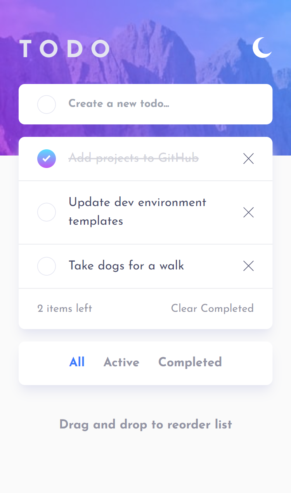
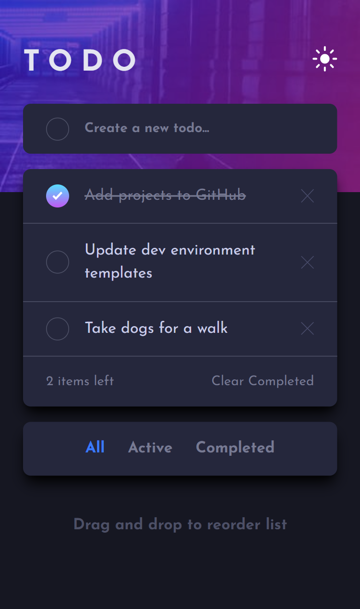

# Frontend Mentor - Todo app solution

This is a solution to the [Todo app challenge on Frontend Mentor](https://www.frontendmentor.io/challenges/todo-app-Su1_KokOW). Frontend Mentor challenges help you improve your coding skills by building realistic projects. 

## Table of contents

- [Overview](#overview)
  - [The challenge](#the-challenge)
  - [Screenshot](#screenshot)
- [My process](#my-process)
  - [Built with](#built-with)
  - [What I learned](#what-i-learned)
  - [Useful resources](#useful-resources)
- [Author](#author)
- [Acknowledgments](#acknowledgments)

## Overview

### The challenge

Users should be able to:

- View the optimal layout for the app depending on their device's screen size
- See hover states for all interactive elements on the page
- Add new todos to the list
- Mark todos as complete
- Delete todos from the list
- Filter by all/active/complete todos
- Clear all completed todos
- Toggle light and dark mode
- **Bonus**: Drag and drop to reorder items on the list

### Screenshot

## My process

### Built with

- [React](https://reactjs.org/) - JS library
- [TypeScript](https://www.typescriptlang.org/) - JS Superset
- [Tailwind CSS](https://tailwindcss.com/) - Styles

### What I learned

This was a nice refresher on implementing CRUD actions in React. I also learned how to create a drag and drop list in React without external libraries.

### Useful resources

- [Drag and Drop in React without using any External Library](https://www.aurigait.com/blog/drag-and-drop-in-react/) - Very helpful in explaining the logic behind drag events in React and how to implement them.
- [Creating a Drag and Drop List with React Hooks](https://dev.to/florantara/creating-a-drag-and-drop-list-with-react-hooks-4c0i) - Useful for styling the element that will be moved after dropping.

## Author

- Website - [Justin Fowler Art](https://www.justinfowlerart.com)